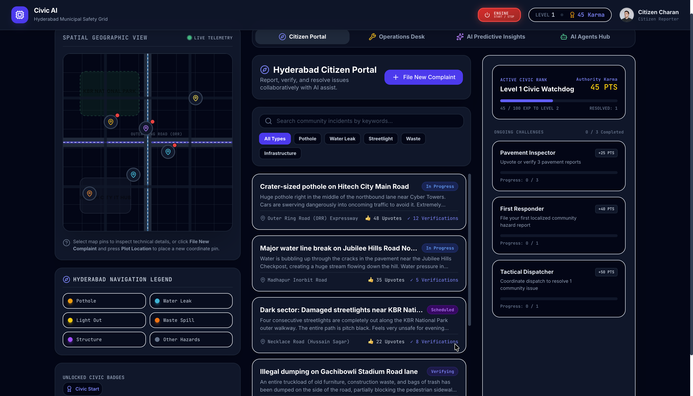
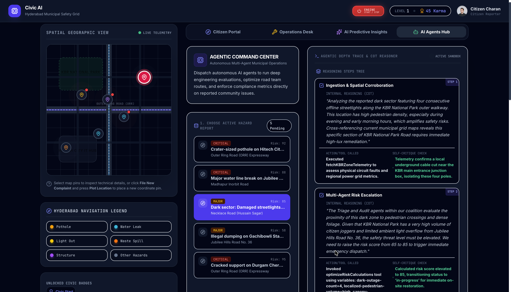
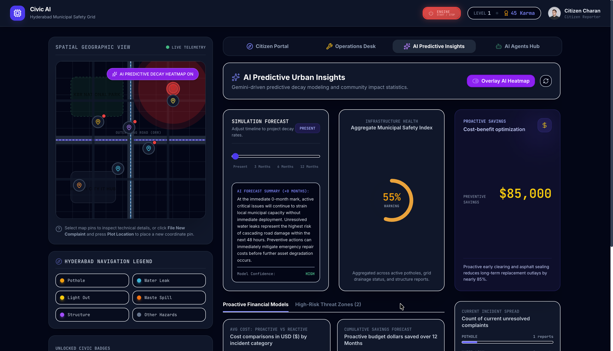
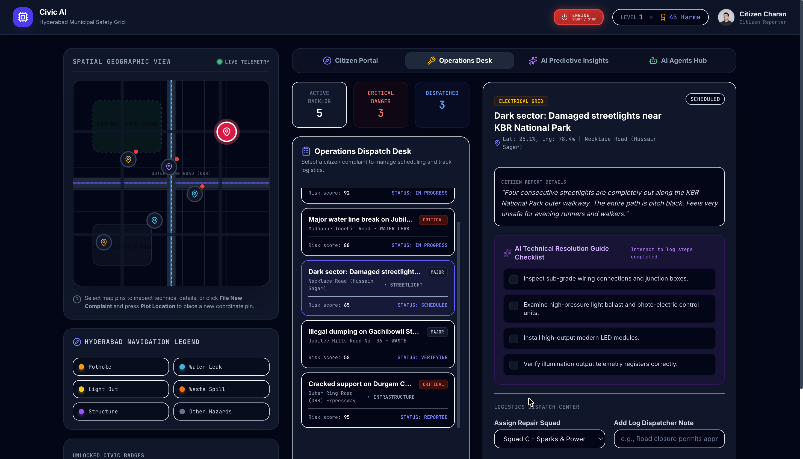

# 🏙️ CivicAI

> **AI-Powered Urban Operations & Predictive Infrastructure Management Platform**

CivicAI is a full-stack AI-powered platform that modernizes civic infrastructure management by combining **Agentic AI**, **Predictive Analytics**, and **Geospatial Intelligence**. It empowers citizens to report urban issues while enabling municipal authorities to make informed decisions through AI-assisted workflows, predictive scenario simulations, and intelligent operational recommendations.

---

## 🌐 Live Demo

**🔗 Application:**  
https://vibe2ship-community-ai-hub-1008517491164.asia-southeast1.run.app/

---

## 📸 Application Preview

### 👥 Citizen Portal



The primary interface where citizens can report civic issues, verify existing reports, engage with the community, and track issue progress.

---

### 🤖 Agentic AI Command Center



Specialized AI agents assist municipal authorities by analyzing issues, assessing severity, generating operational recommendations, and supporting infrastructure management.

---

### 📊 Predictive Insights



AI-powered scenario simulations forecast infrastructure health, future incidents, repair costs, cascading failures, and preventive maintenance strategies.

---

### 🏢 Operations Dashboard



A centralized dashboard for municipal officers to manage reported issues, update statuses, and monitor city-wide operations.

---


# ✨ Features

## 👥 Citizen Portal

- Report civic issues with descriptions and images
- Community verification and upvoting
- Comment on existing reports
- Track issue lifecycle
- Gamified engagement through **Karma**, **Levels**, and **Achievement Badges**

---

## 🤖 Agentic AI Command Center

Specialized AI agents assist municipal authorities.

### 🩺 TriageBot
- Issue classification
- Severity assessment
- Risk analysis

### 🚛 RouteBot
- Operational recommendations
- Resource planning
- Response strategy generation

### 📋 AuditBot
- Operational review
- Compliance assessment
- Quality verification

### 🤝 Coalition Mode
Combines recommendations from multiple AI agents to provide unified operational guidance.

---

## 📈 Predictive Urban Intelligence

Generate AI-powered scenario simulations for:

- Infrastructure Health Index
- Future Infrastructure Condition
- Expected New Incidents
- Estimated Repair Cost
- Preventive Cost Savings
- Cascading Infrastructure Failures
- High-Risk Zones
- Preventive Maintenance Recommendations

---

## 🗺️ Geospatial Intelligence

- Interactive city map
- Live issue visualization
- AI heatmap overlay
- High-risk zone monitoring
- Geographic incident distribution

---

## 🏢 Municipal Operations Dashboard

Municipal authorities can:

- Monitor city-wide infrastructure
- Manage issue lifecycle
- Update operational status
- Review AI-generated recommendations
- Track infrastructure health

---

# 🧠 AI Capabilities

Google Gemini powers:

- Intelligent issue classification
- Severity assessment
- Risk analysis
- Agentic operational recommendations
- Infrastructure health evaluation
- Scenario-based forecasting
- Preventive maintenance planning
- Decision support for municipal operations

---

# 🏗️ System Architecture

```text
                    Citizens
                        │
                        ▼
                React Frontend
                  (App.tsx)
                        │
 ┌────────────┬────────────┬─────────────┬──────────────┐
 ▼            ▼            ▼             ▼              ▼
Citizen     VibeMap     OpsDesk   Predictive AI   Agentic AI
Portal
 │            │            │             │              │
 └────────────┴────────────┴─────────────┴──────────────┘
                        │
                  REST API Layer
                        │
                        ▼
              Express Backend (Node.js)
                        │
          ┌─────────────┴──────────────┐
          ▼                            ▼
     Google Gemini API           Local Data Store
```

---

# 🔄 Application Workflow

```text
Citizen reports issue
          │
          ▼
Gemini analyzes report
          │
          ▼
Category • Severity • Risk
          │
          ▼
Issue stored
          │
          ▼
Operations Dashboard
          │
          ▼
Agentic AI Recommendations
          │
          ▼
Predictive AI Scenario Simulation
```

---

# 🛠️ Tech Stack

### Frontend
- React
- TypeScript
- Vite
- Tailwind CSS
- Motion
- Recharts
- Lucide React

### Backend
- Node.js
- Express.js

### AI
- Google Gemini API

### Cloud
- Google AI Studio
- Google Cloud Run

---

# 📂 Project Structure

```text
src
│
├── components
│   ├── CitizenPortal.tsx
│   ├── AgenticCommandCenter.tsx
│   ├── PredictiveInsights.tsx
│   ├── OpsDesk.tsx
│   └── VibeMap.tsx
│
├── App.tsx
├── server.ts
├── types.ts
└── main.tsx
```

---

# 🎮 Community Engagement

To encourage sustained citizen participation, CivicAI incorporates a lightweight gamification system featuring:

- ⭐ Karma Points
- 🏅 Achievement Badges
- 📈 User Levels
- 👍 Community Verification
- 🤝 Issue Support & Upvoting

This promotes high-quality reports and active community involvement.

---

# ⚙️ Installation

Clone the repository

```bash
git clone https://github.com/<your-username>/civic-ai.git
```

Navigate into the project

```bash
cd civic-ai
```

Install dependencies

```bash
npm install
```

Create a `.env` file

```env
GEMINI_API_KEY=YOUR_GEMINI_API_KEY
```

Run the development server

```bash
npm run dev
```

Build for production

```bash
npm run build
```

Run production build

```bash
npm start
```

---

# 📋 Environment Variables

| Variable | Description |
|----------|-------------|
| `GEMINI_API_KEY` | Google Gemini API Key |

---

# 🚀 Future Enhancements

- AI Duplicate Issue Detection
- Multi-Agent Orchestration
- Weather-aware Infrastructure Forecasting
- Google Maps Integration
- Firebase Authentication
- Firestore Database
- Crew Optimization Engine
- Retrieval-Augmented Generation (RAG)
- Real-time Notifications

---

# 📊 Project Highlights

- ✅ Full-Stack AI Application
- 🤖 4 Specialized AI Agents
- 📈 AI Scenario Forecasting
- 🗺️ Geospatial Visualization
- 🏢 Municipal Operations Dashboard
- 🎮 Community Engagement System
- ☁️ Deployed on Google Cloud Run
- ⚡ Powered by Google Gemini

---

# 👨‍💻 Author

**Sai Charan Nethi**

B.Tech, Computer Science & Engineering  
National Institute of Technology Durgapur

- 💼 LinkedIn: *Add your LinkedIn profile*
- 💻 GitHub: *Add your GitHub profile*

---

# ⭐ Support

If you found this project interesting, consider giving it a ⭐ on GitHub!
